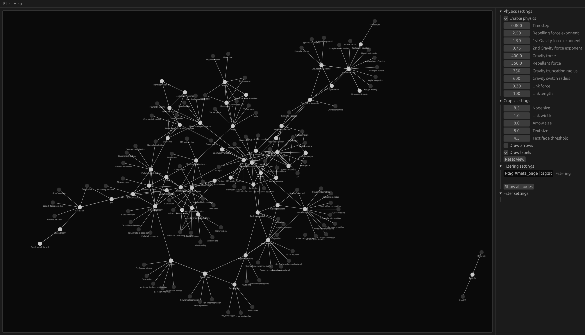

# Obsidian Graph Analyser
Obsidian Graph Analyser is a visualisation tool for networks of linked markdown documents made in [ObsidianMD](https://obsidian.md/). Features include:

- Shortest path algorithms (Drijkstra, A*)
- Local graphs for individual pages as well as groups of pages
- Alternative graph drawing techniques (Force-directed layout, Spectral layout, Arc layout)
- Graph analysis tools (Link prediction, Jarrard Similarity, Centrality)

